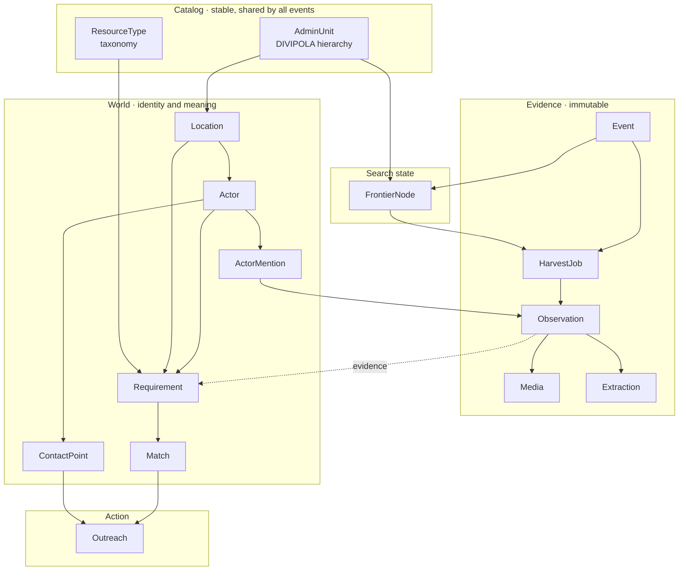

# Data model

How the pieces fit together. Field-level detail lives in the code — this explains what each
model is *for* and why the boundaries fall where they do.

App: `ayudagente.radar` (label `radar`). Models are split by layer under
`ayudagente/radar/models/` and re-exported from the package.

---

## The one idea that shapes everything

Three things are kept apart that are tempting to merge:

**Evidence → Interpretation → State of the world.**

An `Observation` is what we scraped: a post, with its permalink and timestamp. It is
immutable. An `Extraction` is what the model understood from it. A `Requirement` is what we
believe is true in the world, supported by one or more observations.

This matters because of a concrete case. When someone posts *"we no longer need water at the
Coliseo"*, that does not delete the earlier requirement. It is **a new observation that
changes its status**. History is preserved and every closure can be explained. If extraction
were allowed to write over evidence, none of that would be auditable — and re-running a
better prompt would mean re-scraping everything.

---

## Layers

---

## Catalog

**`AdminUnit`** is Colombia's official administrative division (DIVIPOLA), loaded once and
shared across every event. It is the backbone of geographic scoping: the agent widens its
search by walking real entities rather than inventing place names. Its `centroid` is what
lets us rank municipalities by distance to the epicenter and build the cadence rings without
geocoding anything.

**`ResourceType`** is the taxonomy of what people need and offer. It is a table rather than
an enum so resources can be added during an emergency without a migration, and it is
hierarchical so a need for *sleeping mats* can be satisfied by an offer of *bedding* when
nothing closer exists.

Neither belongs to an event. Everything else does.

---

## Event: the isolation boundary

**`Event`** is one concrete disaster. Actors, requirements and frontier nodes belong to
exactly one event and never mix across events. Two simultaneous emergencies mean two
independent agents, two budgets and two frontiers, sharing nothing but the catalog above.

Its `lexicon` field carries how people actually name the event — hashtags, nicknames — and,
under `negatives`, the terms of *other* concurrent emergencies. Those negatives get injected
into every query. During the pilot, searches without them pulled in earthquakes from
Venezuela, Peru, Indonesia and Granada; this is the cheapest defense against conflating two
disasters, and it lives as data rather than as code so it can be tuned mid-event.

The budget lives here too, which is what makes cost a first-class constraint rather than an
afterthought.

---

## Evidence

**`HarvestJob`** is a harvesting decision turned into an executable record — the *only*
artifact the frontier agent produces. The agent decides and writes the job; a worker
executes it against Apify. That split is what lets a failed harvest be retried without
invoking the model again, and it is why Azure rate limits never corrupt agent state.

Its `rationale` field stores in plain text why the agent chose this municipality, this
platform and this budget. Not needed to run; needed to debug and to show the agent's
judgment on the dashboard.

Its `actor_down` status exists because an Apify Actor can return success with zero results
while actually being broken — we hit exactly this during the pilot. Mistaking that for
"no signal here" makes the frontier penalize a municipality that did have information.

**`Observation`** is a post or comment exactly as the platform returned it. The author
snapshot lives here rather than on `Actor` because profiles change and we want the state at
posting time. Which fields arrive varies by platform, so all of them are optional:

| | X | Instagram | Facebook | TikTok |
|---|---|---|---|---|
| Follower count | yes | **no** | **no** | yes |
| Avatar | yes | **no** | yes | yes |
| Native geo | 2% | 34% | **0%** | 19% |
| Has media | 53% | 100% | 44% | 100% |

Those gaps are measured, not assumed. Two consequences: credibility scoring must be computed
per platform because the signal that exists differs, and real location almost always has to
be extracted from text rather than read from metadata.

**`Media`** holds imagery with **our own permanent copy**. Platform media URLs are signed
and expire within hours, so storing only the link leaves the frontend with broken images and
the model with nothing to re-evaluate. For videos we keep the frames the vision model
actually looked at, not the full file, so audits are reproducible without the storage cost.

Two fields earn their place. `platform_alt_text` is text the platform gives away: Facebook
returns it on 100% of posts carrying media and it transcribes the text on the flyer, which
often removes the need to call the vision model at all. `sha256` catches the same photo
recycled across posts and across events — the cheapest defense against image-based
misinformation, since a picture posted as both "Chocó" and "Venezuela" is caught without
spending a single inference call.

**`Extraction`** is what the model understood, one-to-one with the observation.
Classification, structured fields, image reading and the geocoding query string all come out
of a *single* schema-constrained multimodal call. One call rather than four because Azure's
per-deployment TPM quota is the real bottleneck, and because the model resolves
contradictions better when it sees text and image together.

One extraction can produce **several** requirements — a post listing three collection
centers produces three. That relation lives on `Requirement.evidence`, not here.

---

## World

**`Location`** is a resolved point that always records **how fine it is**. Precision is not
decoration: a need placed in "Chocó" and a truck heading to a street address are both a dot
on a map, and without knowing that one covers a whole department the system proposes
impossible deliveries. Locations are deduplicated on normalized text plus admin unit, so a
frequently-mentioned place is geocoded once rather than a hundred times — a cache and a
direct saving on the Google bill.

**`Actor`** is the node of the graph: any entity that needs or offers something. Unifying
the same actor across dozens of posts under different names is the hardest data problem in
the system — without stable identity there is no saturation counting and no outreach
history.

Resolution runs as a cascade, and **embeddings are the weakest signal in it, not the first**:

1. Deterministic keys — same platform handle, same normalized phone, same email
2. Blocking by municipality, so only plausible candidates are compared
3. Trigram similarity (`pg_trgm`), which beats semantic similarity on proper nouns
4. Embeddings (`pgvector`), for the same place worded differently
5. LLM adjudication of what remains ambiguous

Step 4 exists precisely because steps 1–3 miss *"Cruz Roja Risaralda"* vs *"Seccional
Risaralda de la Cruz Roja Colombiana"*. It is not the primary mechanism: `"Coliseo Mayor"`
and `"Coliseo Menor"` are nearly identical as vectors and are different places.

`merged_into` keeps duplicates instead of deleting them so a bad merge can be undone. The
model will get one wrong eventually.

**`ActorMention`** is the audit trail of that cascade: which post, which surface form, which
signal resolved it, and the model's reasoning. It is what makes a bad merge diagnosable
rather than mysterious.

**`ContactPoint`** is one concrete way to reach an actor — handle, phone, email, payment
account. It is its own table rather than a JSON blob because it must be queried, because
attempts are counted per channel, and because one channel can be marked bounced without
touching the others. Contact details also surface incrementally: the phone appears in one
post, the email three days later.

`value` is normalized and `raw_value` preserved. `"300 2377012"`, `"+57 300 237 7012"` and
`"3002377012"` are one phone; without normalization the uniqueness constraint is worthless.
`times_seen` is a confidence signal — a number appearing across five posts is almost
certainly real, one appearing once may be a hallucination.

`allows_automatic_outreach()` is the policy, and it **fails closed**: email to organizations
at high confidence, nothing else. Direct messages, phone and anything aimed at an individual
always route through human review. Anything not explicitly permitted returns False, because
the default when writing to someone during an emergency has to be not to write.

---

## Supply and demand

**`Requirement`** holds needs and offers in **one table** separated by `direction`. They
share every field but polarity, and a single post routinely produces both: *"we have plenty
of food but no way to move it"* is an offer of food and a need for transport from the same
actor. Unified, matching is one query — opposite direction, compatible resource, nearby
locations, overlapping windows. Split, it is two queries and a pile of special cases.

Transport is the case that justifies the shape: five trucks are one row with
`resource=transport`, `quantity=5`, `location` as origin and `destination` as drop-off.
Every other resource leaves `destination` null.

`quantity` and `covered_quantity` are what make saturation work. When a center needs 20
volunteers and 10 are committed, the system stops proposing it once the total is reached.
Without this it keeps pushing people toward a saturated site — the failure that does the
most harm in a real emergency.

**`Match`** links a need to an offer, optionally **through** a transport requirement.
`via_transport` is what makes three-node chains work: food in Bogotá satisfies a need in Cali
only when a transport requirement connects them. Chains longer than that are a theoretical
problem we do not have.

Matches are produced in batch. The matching pass loads the event's open requirements into an
in-memory graph (NetworkX) and solves an allocation problem over it, because pairwise greedy
matching leaves needs uncovered that had a solution. Postgres stays the source of truth; the
graph is rebuilt and thrown away each pass. Connected-component analysis on that same graph
yields the most valuable alert in the system: *needs with no reachable supply at all*.

**Recomputation only rewrites rows still in `proposed`.** Anything at `contacted` or beyond
is frozen, because by then a real person has been written to.

---

## Action

**`Outreach`** is one message to one actor about one match, from draft to reply. This is
where the system stops observing and starts intervening, so it carries the strictest
guarantees: who was written to, on which channel, drafted by which model, approved by which
person.

`idempotency_key` is unique and derived from recipient, match and channel. A Celery task can
retry three times, but the message is created once — which is what keeps "ten people already
contacted" true rather than approximately true.

---

## Search state

**`FrontierNode`** is one searchable cell — a municipality on a platform — with its running
performance: yield rate, credibility, distance, freshness, cost, and the resulting score and
cadence.

**This is the only table the agent reads.** Around fifty rows, roughly two thousand tokens.
It never sees a single post. Reading a scoreboard and deciding where to spend under
uncertainty is judgment, which is what a model is good at; extracting a phone number from a
caption is a function, which it is not. Keeping raw data out of the agent's context is what
makes the loop cheap, parallelizable and debuggable.

The score **divides by cost** deliberately. Without that divisor the agent burns the budget
on platforms that look productive per item but not per dollar — during the pilot, TikTok
cost 16× more per actionable item than X while looking comparably useful by raw count.

`is_unexplored` exists to support forced exploration. A fixed share of the budget must always
go to nodes with no history, or the agent converges onto what it already knows and never
finds the rural district nobody was posting about twenty minutes ago — precisely the
highest-value case.

---

## Invariants worth defending in review

1. `Observation` is never updated or deleted. New information is a new row.
2. `Extraction` never writes into `Observation`.
3. A `Match` past `proposed` is never rewritten by the matching pass.
4. `ContactPoint.allows_automatic_outreach()` fails closed.
5. `Outreach` is only ever created through its idempotency key.
6. Actor merges set `merged_into`; they never delete.
7. Every `Location` carries its precision, and matching enforces a minimum.

---

## Infrastructure this model requires

- **PostGIS** for proximity queries and spatial indexes → `postgis/postgis:16-3.4`
- **pgvector** for actor embeddings → installed on top of that image
- **pg_trgm** for name similarity, and **unaccent** for normalization
- Django is configured with `django.contrib.gis` and the `postgis` database backend
- The container publishes **port 5433**, to avoid colliding with a system Postgres on 5432
